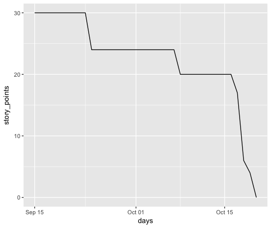

# Trello toy
Projeto da disciplina Engenharia de Software da UFMG - 2019/2

Implementaremos um sistema inspirado no Trello

# Estórias:

* Como usuário do sistema eu gostaria de criar estórias para meu desenvolvimento
	* Criar classe e estrutura de banco para armazenar estórias
	* Implementar métodos de criação de estórias e inserção no banco
	* Criar e implementar elementos da interface

* Como usuário do sistema eu gostaria de quebrar essas estórias em tarefas
	* Adicionar ao banco tabela de tarefas
	* Criar classe de tarefas com métodos de criação e interação a partir de estórias
	* Criar e implementar elementos da interface

* Como usuário do sistema, gostaria de dar atributos como story points, comentários, entre outros às tarefas
	* Atualizar tabela de tarefas/criar tabela de atributos
	* Adicionar à classe de tarefas métodos e propriedades para lidar com atributos
	* Criar e implementar elementos da interface

* Como usuário, gostaria de ter como definir uma equipe
	* Criar tabela e classe de usuários
	* Criar tabela e classe de equipes
	* Criar e implementar elementos da interface

* Como usuário, gostaria de atribuir tarefas a equipe
	* Criar tabela de interação entre equipes e tarefas
	* Implementar métodos e propriedades nas classes para a interação
	* Criar e implementar elementos da interface

* Como usuário, gostaria de poder salvar projetos e acessar projetos diferentes
	* Criar tabela de projetos no banco
	* Criar classe e métodos para projetos
	* Criar e implementar elementos da interface

* Como usuário do sistema eu gostaria de escolher com qual método agil eu vou desenvolver

# Burndown Chart

# Planinha de Apuração de Horas Trabalhadas

https://docs.google.com/spreadsheets/d/1ZDERnxiEVovHCxXZ3s4NCsrBNWd_TaJ4kIdkCQP8f5w/edit?usp=sharing

# Planilha de Apuração de Testes Feitos

https://docs.google.com/spreadsheets/d/1K2QDdKGITtuqcYkG_pSfbvZ4O236W3ENg7yk7_J1uqE/edit?usp=sharing
